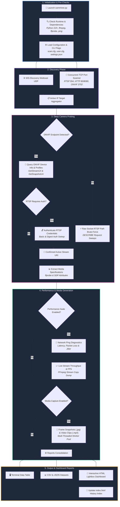

# CamMiner 🔍🎥

**CamMiner** is a modular, high-performance Python utility designed to discover, probe, and assess IP cameras on your local network. It identifies stream protocols (RTSP), resolves video/audio profiles, captures camera snapshots, runs network diagnostic pings, measures live video throughput, and grades each device's suitability for NVR (e.g. Shinobi) or Home Assistant integration.

---

## Flowchart & Architecture

The scanner conducts discovery, authentication, probing, performance sweeps, and report consolidation through the following pipeline:



---

## Features

- **Automated Dependency Pre-Checks**: Validates Python 3.8+, required standard library modules, and system binaries (`ffmpeg`, `ffprobe`, `ping`) on startup, guiding users on missing dependencies.
- **Concurrent Multi-Protocol Scanning**: Discover cameras concurrently using WS-Discovery (multicast UDP) and TCP port scanning (`ThreadPoolExecutor`).
- **Fast Raw Socket RTSP Probing**: Brute forces RTSP URLs using lightweight socket-level `DESCRIBE` requests in milliseconds, only running `ffprobe` on confirmed working streams.
- **RTSP Digest Authentication Support**: Custom challenge-response algorithm handles Basic/Digest RTSP challenges natively.
- **Open-ONVIF Credential Fallback**: If a camera has open ONVIF endpoints but locks the RTSP stream, the prober automatically brute-forces the RTSP stream using user credentials and embeds the working set.
- **ONVIF GetSnapshotUri Resolution**: Resolves and maps camera snapshot URLs (HTTP) and profile tokens.
- **Default Performance Suite (`--no-perf`)**: Ping statistics (latency, loss, jitter) and stream throughput testing are enabled by default.
- **Automated Media Captures (`--no-image` / `--no-video`)**: Automatically captures single-frame `.jpg` snapshots and records short `.mp4` video clips from active streams in parallel.
- **Responsive HTML Lightbox Modal**: Interactive snapshot image thumbnails and inline video previews in HTML dashboard reports expand to `90vw x 90vh` on click without cropping.
- **Target & Credentials Overrides (`--target`, `--user`, `--password`)**: Target single IPs or CIDR blocks (`192.168.0.0/24`) and test specific credentials directly from the command line.
- **Consolidated Archives (`index.html`)**: Automatically generates a historical database index linking all past scan reports.

---

## Prerequisites & Installation

- **Python 3.8+**
- **FFmpeg & FFprobe**: Ensure both binaries are installed and available in system PATH.
  - Linux (Debian/Ubuntu): `sudo apt update && sudo apt install -y ffmpeg iputils-ping python3`
  - macOS (Homebrew): `brew install ffmpeg`
  - Arch Linux: `sudo pacman -S ffmpeg iputils python`
- See [requirements.txt](file:///home/flashbsb/camminer/requirements.txt) for a complete list of required system binaries and standard Python modules.
- `camminer.py` automatically performs dependency checks upon launch and prints installation guidance if any required dependency is missing.

---

## Configuration

Configurations are stored inside the `config/` directory:

1. **`config/settings.json`**:
   - `timeout`: Default network socket timeout (seconds).
   - `socket_timeout`: Global default socket timeout for HTTP & urllib requests (seconds).
   - `port_scan_timeout`: TCP port scanning connection timeout per port (seconds).
   - `ws_discovery_timeout`: ONVIF WS-Discovery UDP multicast socket timeout (seconds).
   - `rtsp_socket_timeout`: RTSP stream connection timeout (seconds).
   - `ffmpeg_socket_timeout`: FFmpeg/FFprobe socket timeout for stream probing and media capture (seconds).
   - `threads`: Thread pool size for parallel network host scanning.
   - `media_max_threads`: Worker thread limit for parallel camera image snapshot and video clip generation.
   - `snapshot_jpeg_quality`: Quality scale factor for JPEG snapshot captures (`1` highest to `31` lowest).
   - `perf_ping_count`: Count of ping packets sent per target during performance tests.
   - `perf_stream_duration`: Length of live ffmpeg stream copy tests and video clip recordings (seconds).
   - `export_formats`: Default report output formats (`terminal`, `csv`, `html`, `json`).
   - `scan_ports`: Target TCP ports (e.g. `554`, `8554`, `80`, `8080`, `8888`, `5000`, `3702`).
   - `common_rtsp_paths`: Common RTSP paths list to check during stream brute forcing.
   
2. **`config/scan.cfg`**:
   - List of IP addresses, ranges (e.g., `192.168.0.10-192.168.0.50`), or subnets (e.g., `192.168.0.0/24`) to target.
   
3. **`config/user.cfg`**:
   - List of credentials (format `username:password`) tested for ONVIF and RTSP access.

---

## Usage

### Run a Standard Full Scan (Probing, Performance & Media Capture):
```bash
./camminer.py
```

### Scan Specific Targets (Bypassing `scan.cfg`):
```bash
./camminer.py --target 192.168.0.33 --target 192.168.0.128/25
```

### Test Specific Credentials (Bypassing `user.cfg`):
```bash
./camminer.py --user adminabc --password passwordabc
```

### Fast Scan Disabling Performance or Media Generation:
```bash
./camminer.py --no-perf --no-image --no-video
```

### Specify Custom Settings, Configuration, and Outputs:
```bash
./camminer.py \
  -c ../custom_scan.cfg \
  -u ../custom_user.cfg \
  -s ../custom_settings.json \
  -o ../output_reports_dir/
```

---

## Output Reports

Outputs are saved in the configured output directory (default: `infos/`):
- **`scan_report_*.csv`**: Flat sheet dataset containing resolved URLs, codecs, pings, media paths, and NVR ratings.
- **`scan_report_*.json`**: Serialized database of scanned metrics.
- **`scan_report_*.html`**: Interactive responsive dashboard showcasing summary distributions, chart graphics, filterable tables, copyable links, and lightbox media viewers.
- **`media/`**: Subdirectory containing snapshot images (`.jpg`) and video clips (`.mp4`).
- **`index.html`**: Consolidated historical log linking all past scans in chronological order.
